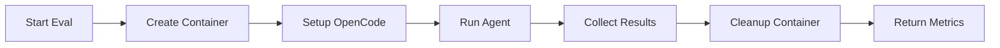

# Container Use Integration Strategy

**Last Updated**: 2025-01-19  
**Purpose**: Isolated environments for agent evaluation using Container Use MCP  
**Priority**: Implement alongside Evalite benchmarking

---

## Overview

**Container Use** provides isolated, containerized environments for running OpenCode agents during evaluation. This enables:

- 🔒 **Safe Evaluation** - Each eval runs in isolation
- 🧹 **Clean Slate** - No cross-contamination between runs
- 📊 **Reproducible Results** - Consistent environment for benchmarking
- 🚀 **Parallel Testing** - Run multiple evals simultaneously
- 🔍 **Debug Capability** - Drop into environments when evals fail

---

## Architecture

### Integration Point

## Architecture

### Integration Point

```text
Evalite Benchmark
    ↓
Agent Executor
    ↓
Container Use MCP ← Creates isolated environment
```

### Environment Lifecycle



---

## Setup

### 1. Install Container Use

```bash
# macOS
brew install dagger/tap/container-use

# Verify installation
container-use --version
```

### 2. Configure OpenCode with Container Use MCP

Add Container Use as an MCP server in `opencode.json`:

```json
{
  "mcpServers": {
    "container-use": {
      "command": "container-use",
      "args": ["stdio"],
      "env": {},
      "timeout": 120000
    }
  }
}
```

### 3. Set Default Container Configuration

```bash
# Node.js base image for this project
container-use config base-image set node:20

# Install dependencies
container-use config install-command add "npm install"

# Setup TypeScript
container-use config setup-command add "npm run build"
```

---

## Implementation

### Updated Agent Executor with Container Use

```typescript
// src/agent-executor.ts
import { opencode } from '@opencode/sdk';
import { reportTrace } from 'evalite/traces';
import { randomUUID } from 'node:crypto';

export interface AgentResult {
  success: boolean;
  output: string;
  metrics: {
    tokenCount: number;
    executionTime: number;
    stepCount: number;
  };
  syntaxValid: boolean;
  errors?: string[];
  environmentId?: string;  // Container environment ID
}

export interface ExecuteOptions {
  output?: string;
  language?: string;
  timeout?: number;
  isolated?: boolean;  // Use Container Use isolation
  cleanup?: boolean;   // Cleanup after execution (default: true)
}

/**
 * Execute OpenCode agent with Container Use isolation
 */
export async function executeAgent(
  agentName: string,
  task: string,
  options: ExecuteOptions = {}
): Promise<AgentResult> {
  const {
    isolated = true,
    cleanup = true,
    timeout = 60000
  } = options;
  
  const startTime = performance.now();
  let environmentId: string | undefined;
  
  try {
    // 1. Create isolated environment if requested
    if (isolated) {
      environmentId = await createIsolatedEnvironment(agentName);
    }
    
    // 2. Execute agent via OpenCode SDK
    const result = await executeOpencodeAgent(
      agentName,
      task,
      environmentId,
      options
    );
    
    // 3. Collect metrics
    const executionTime = performance.now() - startTime;
    
    // 4. Report trace for Evalite
    if (result.usage) {
      reportTrace({
        start: startTime,
        end: performance.now(),
        input: [{ role: 'user', content: task }],
        output: result.output,
        usage: {
          inputTokens: result.usage.promptTokens,
          outputTokens: result.usage.completionTokens,
          totalTokens: result.usage.totalTokens
        }
      });
    }
    
    return {
      success: true,
      output: result.output,
      metrics: {
        tokenCount: result.usage?.totalTokens || 0,
        executionTime,
        stepCount: result.steps || 1
      },
      syntaxValid: await validateSyntax(result.output, options.language),
      environmentId
    };
    
  } catch (error) {
    const executionTime = performance.now() - startTime;
    
    return {
      success: false,
      output: '',
      metrics: {
        tokenCount: 0,
        executionTime,
        stepCount: 0
      },
      syntaxValid: false,
      errors: [error instanceof Error ? error.message : String(error)],
      environmentId
    };
    
  } finally {
    // 5. Cleanup container environment
    if (cleanup && environmentId) {
      await cleanupEnvironment(environmentId);
    }
  }
}

/**
 * Create isolated environment using Container Use MCP
 */
async function createIsolatedEnvironment(agentName: string): Promise<string> {
  const envId = `eval-${agentName}-${randomUUID().substring(0, 8)}`;
  
  // Container Use creates environment automatically when agent uses it
  // We just need to return a unique ID
  return envId;
}

/**
 * Execute OpenCode agent via SDK
 */
async function executeOpencodeAgent(
  agentName: string,
  task: string,
  environmentId: string | undefined,
  options: ExecuteOptions
) {
  // Load agent configuration
  const agentPath = `.opencode/agents/${agentName}.md`;
  
  // Create OpenCode session
  const session = await opencode.createSession({
    agent: agentPath,
    mcp: {
      servers: environmentId ? {
        'container-use': {
          command: 'container-use',
          args: ['stdio'],
          env: {
            CONTAINER_USE_ENV: environmentId
          }
        }
      } : undefined
    }
  });
  
  try {
    // Execute task
    const result = await session.run(task, {
      timeout: options.timeout || 60000
    });
    
    return {
      output: result.content,
      usage: result.usage,
      steps: result.steps
    };
    
  } finally {
    // Close session
    await session.close();
  }
}

/**
 * Cleanup container environment
 */
async function cleanupEnvironment(environmentId: string): Promise<void> {
  try {
    // Use Container Use CLI to remove environment
    const { execa } = await import('execa');
    await execa('container-use', ['remove', environmentId], {
      timeout: 10000
    });
  } catch (error) {
    // Log but don't fail if cleanup fails
    console.warn(`Failed to cleanup environment ${environmentId}:`, error);
  }
}

/**
 * Validate syntax (simple heuristic)
 */
async function validateSyntax(code: string, language = 'javascript'): Promise<boolean> {
  // Simple validation - could be enhanced with actual parsers
  if (language === 'javascript' || language === 'typescript') {
    const openBraces = (code.match(/{/g) || []).length;
    const closeBraces = (code.match(/}/g) || []).length;
    if (openBraces !== closeBraces) return false;
    
    const openParens = (code.match(/\(/g) || []).length;
    const closeParens = (code.match(/\)/g) || []).length;
    if (openParens !== closeParens) return false;
    
    return true;
  }
  
  return true;
}
```

---

## Evalite Integration

### Updated Hello World Eval

```typescript
// evals/hello-world.eval.ts
import { evalite } from 'evalite';
import { executeAgent } from '../src/agent-executor.js';

evalite('ContainerTaskExecutor: Hello World (Isolated)', {
  data: async () => [
    {
      input: "Create a function called hello(name) that returns 'Hello, {name}!'",
      expected: {
        maxTokens: 500,
        maxTime: 30000,
        containsFunction: true
      }
    }
  ],
  
  task: async (input) => {
    // Execute in isolated container
    const result = await executeAgent('container-task-executor', input, {
      isolated: true,   // Use Container Use
      cleanup: true,    // Auto-cleanup
      timeout: 30000
    });
    
    return result;
  },
  
  scorers: [
    {
      name: 'Token Efficiency',
      description: 'Checks if token usage is under limit',
      scorer: ({ output, expected }) => {
        if (!output.success) return 0;
        
        const tokenScore = output.metrics.tokenCount <= expected.maxTokens ? 1 : 
          Math.max(0, 1 - ((output.metrics.tokenCount - expected.maxTokens) / expected.maxTokens));
        
        return {
          score: tokenScore,
          metadata: {
            tokensUsed: output.metrics.tokenCount,
            tokenLimit: expected.maxTokens,
            environmentId: output.environmentId
          }
        };
      }
    },
    {
      name: 'Time Efficiency',
      description: 'Checks if execution time is under limit',
      scorer: ({ output, expected }) => {
        if (!output.success) return 0;
        
        const timeScore = output.metrics.executionTime <= expected.maxTime ? 1 :
          Math.max(0, 1 - ((output.metrics.executionTime - expected.maxTime) / expected.maxTime));
        
        return {
          score: timeScore,
          metadata: {
            executionTime: output.metrics.executionTime,
            timeLimit: expected.maxTime
          }
        };
      }
    },
    {
      name: 'Functional Correctness',
      description: 'Checks if generated code contains expected function',
      scorer: ({ output, expected }) => {
        if (!output.success || !output.output) return 0;
        
        const hasFunction = 
          output.output.includes('function hello') ||
          output.output.includes('const hello') ||
          output.output.includes('export function hello');
        
        return {
          score: hasFunction ? 1 : 0,
          metadata: {
            outputLength: output.output.length,
            containsFunction: hasFunction,
            syntaxValid: output.syntaxValid
          }
        };
      }
    }
  ]
});
```

---

## Configuration Management

### Project-Specific Container Config

Create `.container-use.config.json`:

```json
{
  "baseImage": "node:20",
  "setupCommands": [
    "npm install"
  ],
  "installCommands": [
    "npm run build"
  ],
  "env": {
    "NODE_ENV": "test",
    "EVAL_MODE": "true"
  }
}
```

### Environment Cleanup Strategy

```typescript
// src/container-cleanup.ts
import { execa } from 'execa';

/**
 * Cleanup all eval environments
 */
export async function cleanupAllEvalEnvironments(): Promise<void> {
  try {
    // List all environments
    const { stdout } = await execa('container-use', ['list', '--format', 'json']);
    const environments = JSON.parse(stdout);
    
    // Filter eval environments
    const evalEnvs = environments.filter((env: any) => 
      env.name.startsWith('eval-')
    );
    
    // Remove them
    for (const env of evalEnvs) {
      await execa('container-use', ['remove', env.name]);
      console.log(`Cleaned up environment: ${env.name}`);
    }
    
  } catch (error) {
    console.error('Cleanup failed:', error);
  }
}

/**
 * Cleanup stale environments (older than 1 hour)
 */
export async function cleanupStaleEnvironments(): Promise<void> {
  try {
    const { stdout } = await execa('container-use', ['list', '--format', 'json']);
    const environments = JSON.parse(stdout);
    
    const oneHourAgo = Date.now() - (60 * 60 * 1000);
    
    for (const env of environments) {
      if (env.name.startsWith('eval-') && new Date(env.created).getTime() < oneHourAgo) {
        await execa('container-use', ['remove', env.name]);
        console.log(`Cleaned up stale environment: ${env.name}`);
      }
    }
    
  } catch (error) {
    console.error('Stale cleanup failed:', error);
  }
}
```

---

## Testing Workflow

### Manual Testing

```bash
# 1. Setup Container Use
brew install dagger/tap/container-use
container-use config base-image set node:20
container-use config install-command add "npm install"

# 2. Run single eval
npx evalite evals/hello-world.eval.ts

# 3. Monitor environment (in another terminal)
container-use list
container-use watch eval-container-task-executor-xxxxx

# 4. Check what happened
container-use log eval-container-task-executor-xxxxx
container-use diff eval-container-task-executor-xxxxx

# 5. Cleanup (automatic, but can be manual)
container-use remove eval-container-task-executor-xxxxx
```

### CI/CD Integration

```yaml
# .github/workflows/eval-tests.yml
name: Agent Evaluations

on: [push, pull_request]

jobs:
  evals:
    runs-on: ubuntu-latest
    
    steps:
      - uses: actions/checkout@v4
      
      - uses: actions/setup-node@v4
        with:
          node-version: '20'
          
      - name: Install Container Use
        run: |
          curl -fsSL https://raw.githubusercontent.com/dagger/container-use/main/install.sh | bash
          
      - name: Install dependencies
        run: npm ci
        
      - name: Run evaluations
        run: npm run benchmark
        env:
          OPENCODE_API_KEY: ${{ secrets.OPENCODE_API_KEY }}
          
      - name: Cleanup containers
        if: always()
        run: npx tsx scripts/cleanup-containers.ts
        
      - name: Upload results
        uses: actions/upload-artifact@v4
        with:
          name: eval-results
          path: .evalite/results.json
```

---

## Debugging Failed Evals

When an eval fails, you can inspect the container:

```bash
# Find the environment
container-use list

# Open terminal in the environment
container-use terminal eval-container-task-executor-xxxxx

# Inside container:
ls -la
cat src/hello.js  # Check generated file
npm test          # Run tests manually
node -e "..."     # Test code snippets

# Exit (Ctrl+D)

# View full log
container-use log eval-container-task-executor-xxxxx

# See git diff
container-use diff eval-container-task-executor-xxxxx
```

---

## Best Practices

### 1. Environment Naming

Use descriptive, consistent names:

```typescript
const envId = `eval-${agentName}-${testName}-${shortUuid}`;
// Example: eval-container-task-executor-hello-world-a1b2c3d4
```

### 2. Automatic Cleanup

Always cleanup in `finally` blocks:

```typescript
try {
  const result = await executeAgent(agent, task, { isolated: true });
  return result;
} finally {
  await cleanupEnvironment(envId);
}
```

### 3. Timeout Management

Set reasonable timeouts:

```typescript
const result = await executeAgent(agent, task, {
  isolated: true,
  timeout: 60000,  // 1 minute max
  cleanup: true
});
```

### 4. Resource Limits

Configure container resource limits:

```bash
# Add to container config
container-use config env set CONTAINER_MEMORY_LIMIT 512m
container-use config env set CONTAINER_CPU_LIMIT 1
```

### 5. Parallel Eval Safety

Container Use handles parallel evals automatically - each gets its own isolated environment.

---

## Performance Considerations

### Container Startup Time

- **First eval**: ~5-10 seconds (image pull + setup)
- **Subsequent evals**: ~1-2 seconds (cached layers)

**Mitigation**: Pre-pull images in CI

```bash
docker pull node:20
```

### Cleanup Performance

- **Per-environment cleanup**: ~1-2 seconds
- **Batch cleanup**: More efficient

**Strategy**: Cleanup after each eval, batch cleanup stale environments periodically

```typescript
// In package.json
{
  "scripts": {
    "cleanup:containers": "tsx scripts/cleanup-containers.ts",
    "cleanup:stale": "tsx scripts/cleanup-stale-containers.ts"
  }
}
```

---

## Security

### Isolation Benefits

- ✅ Agents can't access host filesystem
- ✅ Agents can't interfere with each other
- ✅ Failed evals don't corrupt project state
- ✅ Malicious code is contained

### Network Access

By default, containers have network access. To restrict:

```bash
container-use config env set CONTAINER_NETWORK none
```

---

## Migration Path

### Phase 1: Basic Integration (Week 1)

- [x] Install Container Use
- [ ] Configure MCP in opencode.json
- [ ] Update agent-executor.ts
- [ ] Test with one eval

### Phase 2: Full Integration (Week 2)

- [ ] Add cleanup scripts
- [ ] Configure all evals to use isolation
- [ ] Add CI/CD integration
- [ ] Performance optimization

### Phase 3: Advanced Features (Week 3+)

- [ ] Parallel eval execution
- [ ] Resource limit tuning
- [ ] Debug tooling
- [ ] Monitoring dashboard

---

## References

- [Container Use Documentation](https://container-use.com/introduction)
- [Container Use Guide](../guides/container-use.md)
- [OpenCode SDK](https://opencode.ai/docs/sdk/)
- [OpenCode MCP Server](https://opencode.ai/docs/server/)
- [Evalite Documentation](https://evalite.dev/)

---

## Quick Commands

```bash
# Setup
brew install dagger/tap/container-use
container-use config base-image set node:20

# Run eval with isolation
npm run benchmark

# Monitor
container-use list
container-use watch <env-id>

# Debug
container-use terminal <env-id>
container-use log <env-id>

# Cleanup
container-use remove <env-id>
npm run cleanup:containers
```
